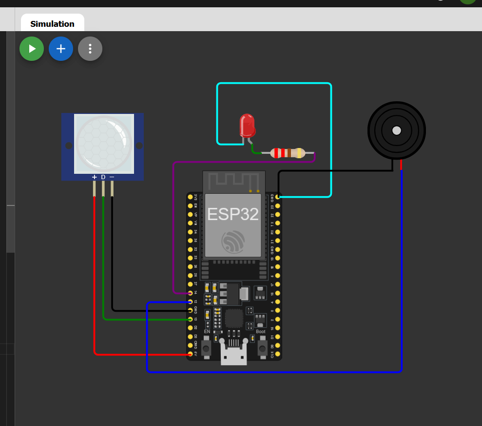

# Smart Intruder Detection System

This project implements a simple **motion detection alert system** using an ESP32 microcontroller and a PIR motion sensor.  
When motion is detected, the system activates an **LED and buzzer** to alert the user.

## Features
- Detects motion using a PIR sensor
- Triggers LED when motion is detected
- Activates buzzer for alert notification
- Displays motion status through serial monitor
- Works as a basic **IoT / Edge computing security system**

## Components Used
- ESP32 Microcontroller
- PIR Motion Sensor
- LED
- Resistor
- Buzzer
- Jumper wires

## Working Principle
1. The PIR sensor continuously monitors infrared radiation changes in its environment.
2. When motion is detected, the sensor outputs a HIGH signal.
3. The ESP32 reads this signal.
4. If motion is detected:
   - LED turns ON
   - Buzzer starts beeping
5. If no motion is detected:
   - LED turns OFF
   - Buzzer stops

## Circuit Diagram

## Project Files
- `sketch.ino` – Smaart Intruder Detection System
- `diagram.json` – Wokwi simulation circuit configuration
- `Circuit_Diagram.png` – Circuit wiring diagram
- `working_vedio.mp4` – Demonstration video of the working project

## Simulation
The project was simulated using **Wokwi ESP32 Simulator**.

## Demo
A short demonstration video of the working system is included in this repository.

## Author
N Nandish# esp32-motion-detection-system
ESP32 motion detection system using PIR sensor that activates LED and buzzer alerts when movement is detected.
